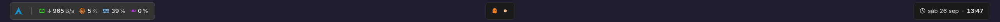

<div align="center">

# hyprland-dotfiles

**Arch Linux · Hyprland 0.56 (config Lua) · barra AGS v3 en TypeScript + GTK4**



*Launcher con stats en hover · workspaces animados y centrados · reloj*

</div>

---

## ✨ Qué tiene

- **Hyprland con config en Lua**: layout *dwindle* en patrón **Fibonacci** (derecha → abajo, mitades exactas),
  la ventana nueva siempre continúa la cadena sin importar el foco, y al vaciar un workspace se salta
  al anterior. El foco de teclado solo cambia con click (`follow_mouse = 2`).
- **Barra propia con [AGS v3](https://github.com/Aylur/ags)** (Astal + GTK4 + TSX + SCSS):
  - 🟦 **Launcher**: logo de Arch que abre `rofi`; al pasar el mouse despliega **red, CPU, RAM y GPU**.
  - 👻 **Workspaces**: íconos (activo / inactivo), animación al abrir o cerrar, **click y rueda del mouse**.
  - 🕐 **Reloj** con fecha en español.
  - Todo leído directo de `/proc` y `/sys`: sin daemons extra.
  - Geometría y simetría **medidas píxel a píxel**.
- Captura de región al portapapeles, OSD de volumen con dunst, historial de portapapeles.

## 🧱 Stack

| Capa | Herramienta |
|---|---|
| Compositor | Hyprland 0.56.2 (`hyprland.lua`) |
| Barra | AGS 3.1.2 · Astal · gnim · GJS · GTK 4.22 · gtk4-layer-shell · dart-sass |
| Wallpaper / notificaciones | hyprpaper · dunst |
| Lanzador / terminal | rofi 2.0 · kitty |
| Fuentes | Adwaita Sans (texto) · JetBrainsMono Nerd Font Propo (íconos) |

La lista completa con el origen (repo/AUR) y la función de cada pieza está en [`TECNOLOGIAS.txt`](TECNOLOGIAS.txt);
las versiones exactas, en [`packages/versions.txt`](packages/versions.txt).

## 📁 Estructura

```
.
├── config/
│   ├── hypr/            hyprland.lua · hyprpaper.conf · scripts/volume.sh · wallpapers/
│   └── ags/             app.ts · widget/*.tsx · lib/sys.ts · style/*.scss · NOTES.md
├── packages/            pacman.txt · aur.txt · versions.txt
├── tools/vptr.py        puntero virtual Wayland para probar hover/click/rueda
├── docs/                capturas
├── install.sh           instala las configs con backup
├── INFORME.md           informe técnico completo (decisiones, problemas, verificación)
└── TECNOLOGIAS.txt      todas las tecnologías usadas
```

## 🚀 Instalación

```bash
git clone <este-repo> ~/hyprland-dotfiles && cd ~/hyprland-dotfiles

# 1. Paquetes de los repos oficiales
sudo pacman -S --needed $(cat packages/pacman.txt)

# 2. Paquetes del AUR (revisá cada PKGBUILD antes)
paru -S $(cat packages/aur.txt)

# 3. Configs (hace backup de ~/.config/hypr y ~/.config/ags si existen)
./install.sh
```

Después cerrá sesión y entrá a Hyprland: la barra arranca sola.
Si tu monitor no es `HDMI-A-1` 2560x1080@100, ajustá `hyprland.lua` y `hyprpaper.conf`.

## ⌨️ Atajos principales

| Atajo | Acción |
|---|---|
| `SUPER + Return` | Terminal (kitty) |
| `SUPER + \|` | Lanzador (rofi) |
| `SUPER + Print` | Captura de región al portapapeles |
| `SUPER + W` | Cerrar ventana |
| `SUPER + F` / `M` | Pantalla completa / maximizar |
| `SUPER + S` | Alternar flotante |
| `SUPER + flechas` | Mover el foco |
| `SUPER + SHIFT + flechas` | Intercambiar ventanas |
| `SUPER + 1..0` | Ir al workspace |
| `SUPER + SHIFT + 1..0` | Mover la ventana al workspace |
| Rueda sobre los workspaces | Workspace anterior / siguiente |

La tabla completa está en [`INFORME.md`](INFORME.md#35-atajos-principales-super--mainmod).

## 🎨 Paleta

`#1a1a1a` fondo · `#e0e0e0` texto · workspaces `#f07f22` / `#f7bf91` ·
CPU `#ff8514` · RAM `#7db2de` · GPU `#a733c4` · red `#3fc433` / `#c43333` · Arch `#1793d1`
